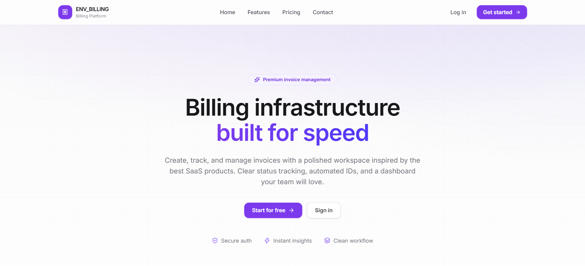
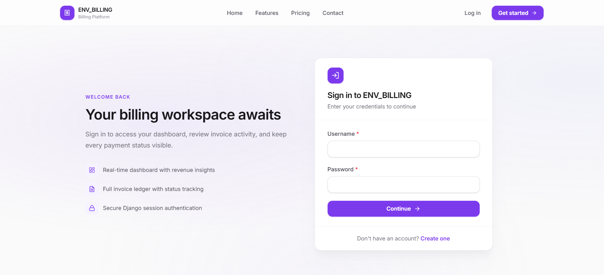
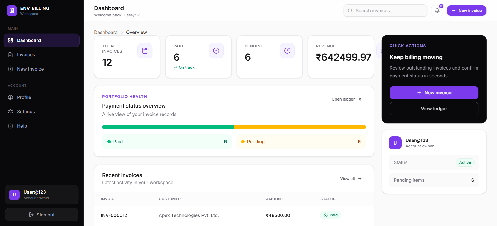
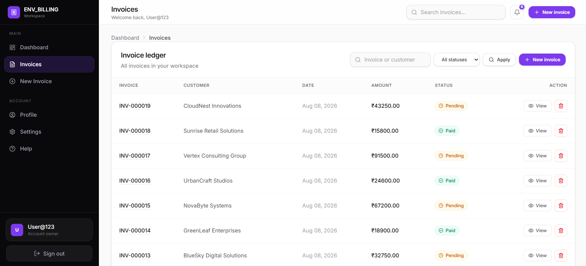
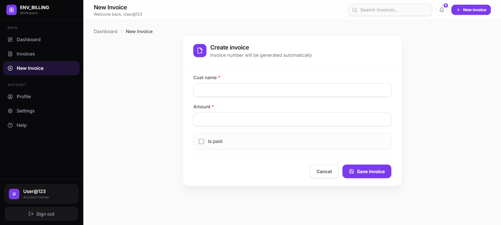
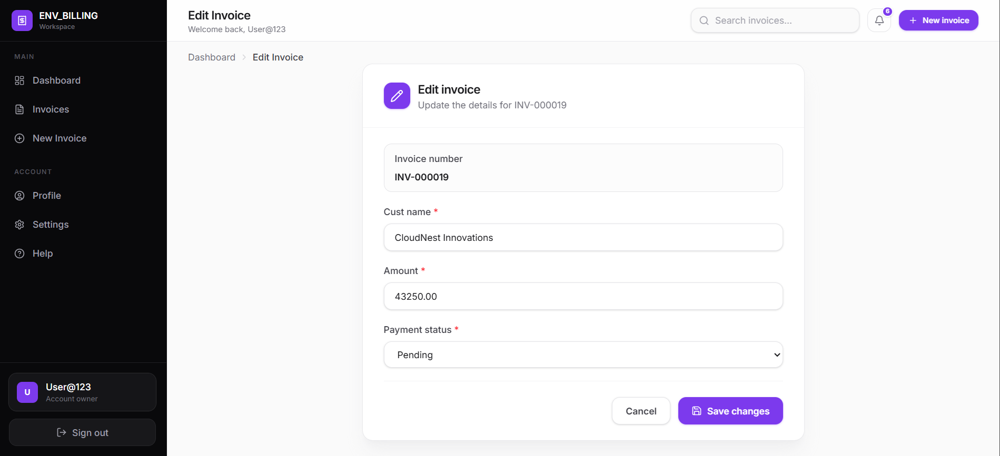
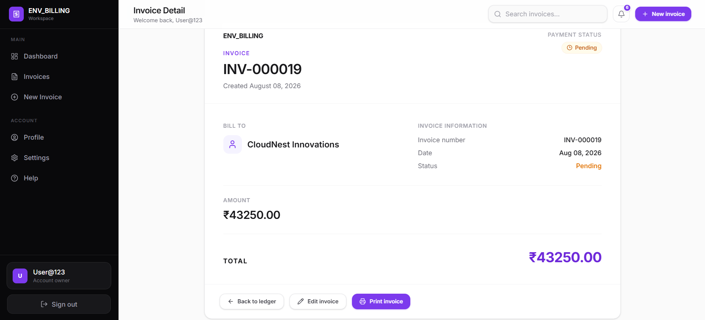

# ENV_BILLING — Invoice Management System

A full-stack Django invoice management platform where authenticated users can create, track, search, filter, and print their own invoices through a Tailwind CSS dashboard.


**Repository:** https://github.com/DevAgarwal15/Invoices_Management_System
**Author:** Dev Agarwal

---

## Overview

ENV_BILLING is a Django-based invoicing workspace built around a single core idea: every user has their own private, authenticated invoice ledger. Users sign up, log in, and land on a dashboard that shows live statistics computed from their own invoices — not demo data. From there they can create invoices, search and filter the ledger, open a print-friendly invoice detail page, edit an invoice's details, and delete records they no longer need.

The project is intentionally scoped as a single-tenant billing workspace (one user = one private set of invoices) rather than a multi-role SaaS product, and this README documents exactly that — nothing more, nothing less.

---

## Key Features (Implemented)

| Area | What it does |
|---|---|
| Authentication | Custom user model, signup, login, logout, login-required views |
| Invoice creation | Form-based invoice creation with server-side validation |
| Automatic invoice numbers | Sequential `INV-000001` style numbers generated in `Invoice.save()` |
| Ownership | Every invoice is tied to an `owner` (ForeignKey to the user); all queries are scoped to `request.user` |
| Dashboard | Live counts (total, paid, pending), total revenue, and 5 most recent invoices — computed from the database on every request |
| Invoice ledger | Searchable, filterable, paginated table of invoices |
| Search | Matches customer name or invoice number (`icontains`) |
| Filter | All / Paid / Pending, combinable with search and preserved across pagination |
| Pagination | 10 invoices per page via Django's `Paginator` |
| Invoice detail page | Single invoice view with an Edit link and a print button |
| Invoice editing | Dedicated `edit_invoice` view/form/template; owner-scoped, updates customer name, amount, and payment status |
| Printing | Browser-native `window.print()` with a dedicated `@media print` stylesheet that hides the sidebar/navigation and shows only the invoice document |
| Delete | POST-only, owner-scoped invoice deletion with a confirmation prompt |
| Notifications | A context processor injects the pending-invoice count and the 5 most recent pending invoices into every authenticated page (used for a notification indicator) |
| Profile page | Read-only view of the logged-in user's account info and invoice count |
| Settings page | Static summary of the account/workspace behavior (no editable settings yet) |
| Help page | Static help/support page |
| Automated tests | A real Django `TestCase` suite in `invoices/tests.py` covering invoice-number generation, owner-scoped access, search + filter, pagination, and delete permissions |

### Not implemented (do not assume these exist)

- No role-based access control — every authenticated user has identical permissions over their own data; there are no admin/staff-only application views.
- No REST API, no PDF generation, no email delivery, no payment gateway, no PostgreSQL, no Docker, no cloud deployment configuration.

---

## Tech Stack

**Backend**

| Technology | Version |
|---|---|
| Python | 3.12 |
| Django | 5.2.16 |
| Django ORM / Auth | built-in |

**Frontend**

| Technology | Notes |
|---|---|
| Django Templates | server-rendered HTML |
| Tailwind CSS | v4 (`^4.3.3`), compiled via `@tailwindcss/cli` |
| Lucide icons | icon set used across templates |
| Vanilla JavaScript | sidebar toggle, dashboard status bar, print trigger |

**Database:** SQLite (`db.sqlite3`, local development)

Python dependencies, as pinned in `requirements.txt`:

```
asgiref==3.12.1
Django==5.2.16
pytailwindcss==0.3.1
sqlparse==0.5.5
tzdata==2026.3
```

---

## Architecture

The project is a standard Django multi-app project with two applications plus the project-level configuration package:

```
mysite/       → project configuration (settings, root URLs, WSGI/ASGI)
accounts/     → authentication (custom user model, signup)
invoices/     → the actual billing application (models, views, dashboard, templates)
```

### `mysite/` — project configuration
- `settings.py` — registers `accounts` and `invoices`, sets `AUTH_USER_MODEL = "accounts.CustomUser"`, configures SQLite, and registers a custom template context processor.
- `urls.py` — the single root URL configuration; there are no per-app `urls.py` files, all routes are declared here directly.

### `accounts/` — authentication
- `models.py` — `CustomUser(AbstractUser)`, a custom user model with no extra fields beyond Django's defaults (kept custom so the user model can be extended later without a disruptive migration).
- `forms.py` — `CustomUserCreationForm`, a `UserCreationForm` subclass exposing `username` and `email`.
- `views.py` — a single `SignUp` view that renders and processes the signup form and redirects to login on success.
- Login/logout are handled by Django's built-in `LoginView` / `LogoutView`, wired up directly in `mysite/urls.py` with custom templates and redirect targets.

### `invoices/` — billing application
- `models.py` — the `Invoice` model (see [Invoice Model](#invoice-model) below).
- `forms.py` — `InvoiceForm`, a `ModelForm` for `cust_name`, `amount`, and `is_paid`, with a `clean_amount` validator that rejects zero/negative amounts.
- `views.py` — dashboard, invoice list/detail, add, delete, paid/unpaid views, plus static profile/settings/help pages. A shared `_invoice_page` helper implements search + filter + pagination for the ledger, paid, and pending views.
- `context_processors.py` — `billing_notifications`, which adds the authenticated user's pending-invoice count and latest pending invoices to every template's context.
- `admin.py` — registers `Invoice` in the Django admin with search, filtering, and ordering configured.
- `templates/` — all invoice and dashboard templates, plus a shared `includes/` directory of reusable components (navbar, sidebar, topbar, table, stats card, status badge, breadcrumbs, alerts).
- `static/` — compiled Tailwind CSS and JavaScript for the frontend.

### Database
SQLite is the only database configured (`mysite/settings.py`), pointed at `db.sqlite3` in the project root. This is well-suited to local development and portfolio demonstration; see [Future Improvements](#future-improvements) for production database plans.

---

## Invoice Model

The `Invoice` model (`invoices/models.py`) has the following fields:

| Field | Type | Notes |
|---|---|---|
| `owner` | `ForeignKey(AUTH_USER_MODEL)` | `on_delete=CASCADE`, `related_name="invoices"` — ties every invoice to exactly one user |
| `cust_name` | `CharField(max_length=200)` | customer name |
| `invoice_number` | `CharField(max_length=50, unique=True)` | auto-generated, blank/null until saved |
| `amount` | `DecimalField(max_digits=10, decimal_places=2)` | invoice amount |
| `date_created` | `DateField(auto_now_add=True)` | set automatically on creation |
| `is_paid` | `BooleanField(default=False)` | payment status |

### Automatic invoice numbering

Invoice numbers are generated in `Invoice.save()`, not by the form. On first save, the model finds the most recently created invoice whose number starts with `INV-`, extracts the numeric suffix, increments it, and formats it as a zero-padded 6-digit number:

```
INV-000001
INV-000002
INV-000003
```

If no prior invoice exists, numbering starts at `INV-000001`. This logic runs regardless of which user owns the invoice — the sequence is global across the whole database, not per-user.

---

## Invoice Workflow

The actual, code-verified workflow is:

```
Sign up / Log in
      │
      ▼
Dashboard (live stats: total, paid, pending, revenue)
      │
      ▼
Add Invoice  →  form validates customer, amount (> 0), and paid/pending status
      │
      ▼
Invoice Ledger  →  search by name/number, filter by status, paginate
      │
      ▼
Invoice Detail  →  view full invoice, print via browser print stylesheet
      │
      ├──▶ Edit Invoice  →  update customer, amount, paid/pending status  →  back to Detail
      │
      ▼
Delete (optional)  →  POST-only, confirmation prompt, owner-scoped
```

Payment status (`is_paid`) can be set at creation time via the add-invoice form, and changed afterward from the **Edit invoice** page (`invoice_edit.html`), reached from a link on the invoice detail page. The edit view (`edit_invoice`) is `@login_required` and re-fetches the invoice scoped to `owner=request.user` before allowing any update, using a dedicated `InvoiceEditForm` (a subclass of `InvoiceForm` that renders payment status as a Paid/Pending choice field instead of a checkbox).

---

## Dashboard

The dashboard (`dashboard` view in `invoices/views.py`) is computed live from the database for the logged-in user on every request:

- **Total invoices** — `Invoice.objects.filter(owner=request.user).count()`
- **Paid invoices** — same queryset filtered by `is_paid=True`
- **Pending invoices** — same queryset filtered by `is_paid=False`
- **Total revenue** — `Sum("amount")` across the user's invoices (defaults to `0` when there are none)
- **Recent invoices** — the 5 most recently created invoices, shown in a table
- A simple paid/pending proportion bar renders next to the stats using the same numbers

Nothing on the dashboard is hardcoded — every value comes from a live query scoped to `request.user`.

---

## Search, Filter & Pagination

Implemented in a shared `_invoice_page` helper used by the full ledger, paid, and pending views:

- **Search** — `?q=` matches `invoice_number` or `cust_name` (case-insensitive, `icontains`), combinable with a status filter
- **Filter** — `?status=all|paid|pending`
- **Pagination** — Django's `Paginator`, 10 invoices per page, ordered by newest first
- Search and filter parameters are preserved in the pagination links (`?page=2&q=...&status=...`), so navigating pages doesn't lose the current search/filter state

---

## Invoice Detail & Printing

The invoice detail page (`invoice_detail.html`) shows the invoice number, customer, creation date, payment status badge, and amount, along with actions: **Back to ledger**, **Edit**, and **Print invoice**.

Printing is implemented entirely on the client side with a `@media print` CSS block scoped to the page:

- The sidebar, header, and any element marked `.no-print` are hidden during printing
- The invoice document's border/shadow is removed so it prints as a clean, borderless document
- Printing is triggered by a button calling the browser's native `window.print()`

There is **no server-side PDF generation** — printing relies entirely on the browser's print function and CSS.

---

## Security

- **Authentication** — every invoice-related view (dashboard, ledger, detail, add, delete, profile, settings, help) is protected with Django's `@login_required` decorator.
- **CSRF protection** — Django's `CsrfViewMiddleware` is enabled project-wide, and all POST forms (add invoice, delete invoice, logout) include ``.
- **Ownership / data isolation** — every invoice query is explicitly filtered by `owner=request.user` (e.g. `Invoice.objects.filter(owner=request.user)`), and single-invoice lookups use `get_object_or_404(Invoice, id=invoice_id, owner=request.user)`. This means a user requesting another user's invoice ID receives a 404, not the invoice — this is verified directly by an automated test (`test_invoice_detail_is_owner_scoped`).
- **Protected delete** — the delete view only accepts `POST` requests and re-fetches the invoice scoped to `owner=request.user` before deleting, so a user cannot delete another user's invoice by ID guessing. This is also covered by an automated test.
- **Protected update** — the edit view re-fetches the invoice scoped to `owner=request.user` (via `get_object_or_404`) before rendering or saving the edit form, so a user cannot update another user's invoice by ID guessing.
- **Server-side validation** — `InvoiceForm.clean_amount` rejects invoice amounts that are zero or negative.

This is a straightforward, single-role security model: authentication plus per-user ownership filtering. There is no role-based access control, no permission groups, and no admin-vs-regular-user distinction beyond Django's built-in `is_staff`/`is_superuser` flags used by the default Django admin.

---

## UI / UX

The frontend is built with server-rendered Django templates styled with Tailwind CSS v4, using a shared `dashboard_base.html` layout for authenticated pages and reusable `includes/` partials.

**Pages present in the codebase:**

| Page | Template |
|---|---|
| Landing / home | `home.html` |
| Login | `accounts/login.html` |
| Signup | `accounts/signup.html` |
| Dashboard | `dashboard.html` |
| Invoice ledger | `invoice_list.html` |
| Paid invoices | `paid_invoices.html` |
| Pending invoices | `unpaid_invoices.html` |
| Add invoice | `add_invoice.html` |
| Invoice detail | `invoice_detail.html` |
| Edit invoice | `invoice_edit.html` |
| Profile | `profile.html` |
| Settings | `settings.html` |
| Help | `help.html` |

**UI components implemented:** a collapsible sidebar with active-link highlighting, a topbar with a notification indicator (backed by the pending-invoices context processor), reusable stats cards, a status badge component (Paid/Pending), a shared invoice table with empty states, breadcrumbs, and alert/message banners for form feedback. The layout is responsive (Tailwind's `sm:`/`lg:`/`xl:` breakpoints are used throughout) and the invoice detail page includes a dedicated print layout.

---

## Screenshots

| Home | Login | Dashboard |
|---|---|---|
|  |  |  |

| Invoice List | Create Invoice | Edit Invoice |
|---|---|---|
|  |  |  |

**Invoice Detail**



---

## Project Structure

```
Invoices_Management_System/
├── accounts/
│   ├── migrations/
│   ├── templates/
│   │   └── accounts/
│   │       ├── login.html
│   │       └── signup.html
│   ├── admin.py
│   ├── apps.py
│   ├── forms.py
│   ├── models.py
│   ├── tests.py
│   └── views.py
├── invoices/
│   ├── migrations/
│   ├── static/
│   ├── templates/
│   │   ├── includes/
│   │   │   ├── components/
│   │   │   ├── alerts.html
│   │   │   ├── breadcrumbs.html
│   │   │   ├── footer.html
│   │   │   ├── invoice_table.html
│   │   │   ├── navbar.html
│   │   │   ├── sidebar.html
│   │   │   ├── stats_card.html
│   │   │   ├── table.html
│   │   │   └── topbar.html
│   │   ├── add_invoice.html
│   │   ├── base.html
│   │   ├── dashboard.html
│   │   ├── dashboard_base.html
│   │   ├── help.html
│   │   ├── home.html
│   │   ├── invoice_detail.html
│   │   ├── invoice_edit.html
│   │   ├── invoice_list.html
│   │   ├── paid_invoices.html
│   │   ├── profile.html
│   │   ├── settings.html
│   │   └── unpaid_invoices.html
│   ├── admin.py
│   ├── apps.py
│   ├── context_processors.py
│   ├── forms.py
│   ├── models.py
│   ├── tests.py
│   └── views.py
├── mysite/
│   ├── asgi.py
│   ├── settings.py
│   ├── urls.py
│   └── wsgi.py
├── screenshots/
│   ├── create_invoice.png
│   ├── dashboard.png
│   ├── edit_invoice.png
│   ├── home.png
│   ├── invoice_detail.png
│   ├── invoice_list.png
│   └── login.png
├── check_admin_users.py
├── manage.py
├── package.json
├── package-lock.json
└── requirements.txt
```

---

## Installation

### Prerequisites
- Python 3.12+
- Node.js and npm (only needed if you want to rebuild the Tailwind CSS output)
- Git

### Steps

```bash
# 1. Clone the repository
git clone https://github.com/DevAgarwal15/Invoices_Management_System.git

# 2. Enter the project directory
cd Invoices_Management_System

# 3. Create a virtual environment
python -m venv venv

# 4. Activate it
# Windows:
venv\Scripts\activate
# macOS/Linux:
source venv/bin/activate

# 5. Install Python dependencies
pip install -r requirements.txt

# 6. (Optional) Install Node/Tailwind tooling if you plan to rebuild the CSS
npm install

# 7. Apply database migrations
python manage.py migrate

# 8. Create a superuser (optional, for /admin access)
python manage.py createsuperuser

# 9. Run the development server
python manage.py runserver

# 10. Open the application
# http://127.0.0.1:8000/
```

---

## Configuration

The project currently does **not** use environment variables — `SECRET_KEY`, `DEBUG`, and `ALLOWED_HOSTS` are hardcoded in `mysite/settings.py` for local development.

**Production security recommendations** (not yet implemented in this codebase):
- Move `SECRET_KEY` into an environment variable and rotate it
- Set `DEBUG = False` and populate `ALLOWED_HOSTS`
- Move the database to a managed production database (see [Future Improvements](#future-improvements))
- Serve static files via a proper static file host (e.g. WhiteNoise or a CDN) rather than Django's development server

---

## Database

The project uses **SQLite** (`db.sqlite3`), configured in `mysite/settings.py`. SQLite is well-suited to local development and portfolio/demo use, but is not intended for concurrent multi-user production traffic — see [Future Improvements](#future-improvements) for the planned migration path.

---

## Testing

The repository includes a real automated test suite in `invoices/tests.py`, built on Django's `TestCase`. It covers:

- Automatic invoice-number generation (`INV-######` format)
- Owner-scoped invoice detail access (a non-owner requesting another user's invoice receives a 404)
- Combined search + status filtering on the ledger
- Pagination with real records
- That core authenticated pages render successfully
- That invoice deletion is POST-only and owner-scoped

Run the suite with:

```bash
python manage.py test
```

You can also sanity-check the project configuration at any time with:

```bash
python manage.py check
```

---

## Future Improvements

The following are **not implemented** in the current codebase and are listed only as a realistic roadmap:

- PostgreSQL for production
- PDF invoice generation
- Email invoice delivery
- Dedicated customer management (customers are currently a free-text field on each invoice)
- Multiple line items per invoice
- Tax and discount support
- Multi-currency support (amounts are currently displayed in ₹/INR only)
- Advanced analytics and reporting
- CSV/Excel export
- Automated payment reminders
- Payment gateway integration
- Environment-variable-based configuration and production deployment (Docker/cloud)
- Team or organization accounts with role-based permissions

---

## Contributing

This is currently a personal/portfolio project. Issues and pull requests are welcome via the [GitHub repository](https://github.com/DevAgarwal15/Invoices_Management_System).

---

## License

MIT License. See the `LICENSE` file for details (add one if not already present in the repository).

---

## Author

**Dev Agarwal**
GitHub: [@DevAgarwal15](https://github.com/DevAgarwal15)
Project: [Invoices_Management_System](https://github.com/DevAgarwal15/Invoices_Management_System)
